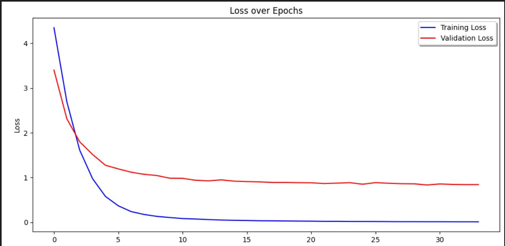
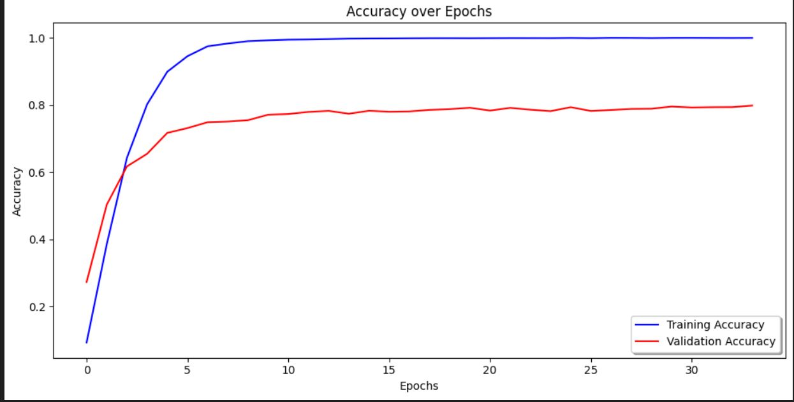
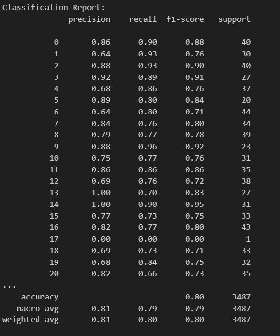
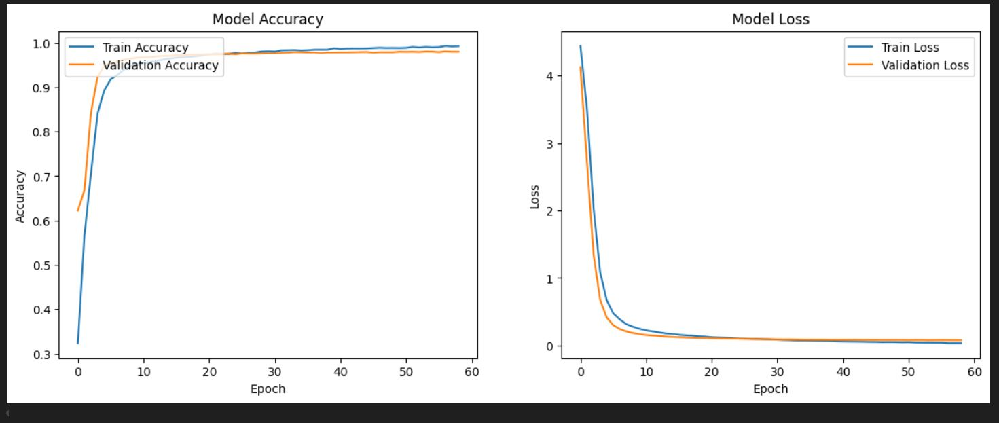
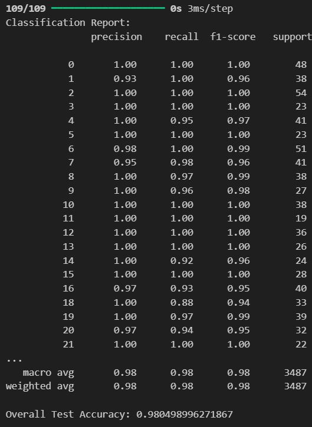

# Celebrity Face Classification with InceptionV3 and FaceNet Embeddings

## Project Overview

This project aims to classify celebrity faces using embeddings generated by a pre-trained InceptionV3 model and fine-tuned for improved accuracy. The generated 128-dimensional embeddings serve as feature vectors, which aid in the classification and identification of each face.
---

### `face_detection_cropped_dataset.ipynb`

**Purpose:**  
This notebook detects faces in a large dataset of celebrity images, crops each detected face, and organizes them into a new folder structure. This is the first step in creating a cleaned dataset of consistent face images for later processing.

**Main Processes:**
1. **Face Detection and Visualization:** Uses the MTCNN model to detect faces in each image and draws bounding boxes around detected faces.
2. **Face Cropping and Saving:** Crops each detected face and resizes it to 224x224 pixels. Saves these cropped images in a new folder structure under a `cropped` directory, with subdirectories for each celebrity.

**Outputs:**
- **Cropped Face Dataset:** Organized in a folder structure where each celebrity's images are saved in separate folders.
- **Log of Images without Faces:** Lists paths to images where no faces were detected.

---

### `npALLDataa.ipynb`

**Purpose:**  
This notebook loads each cropped face image, preprocesses it, and saves it as a .npy file to streamline data loading in subsequent notebooks, generates face embeddings for each cropped image using a pre-trained FaceNet model. The embeddings represent each face as a feature vector, capturing unique characteristics for classification or clustering tasks(this part is extra to our project)

**Main Processes:**
1. **Image and Label Loading:** Loads all images from the `cropped` dataset, resizes them to 224x224 pixels, and applies preprocessing.
2. **Label Mapping:** Maps each image to its respective celebrity label for identification.
3. **Data Storage:** Saves the processed images and corresponding labels as .npy files for efficient model training and evaluation.
4. **Embedding Extraction:** Uses FaceNet to compute a 128-dimensional embedding for each face.
5. **Embedding Storage:** Saves embeddings to a .npy file for use in training models or as inputs to other classification and clustering algorithms.

**Outputs:**
- **all_images.npy:** Contains preprocessed image data for each cropped face.
- **all_labels.npy:** Holds integer labels corresponding to each image.
- **label_mapping.npy:** Maps integer labels to celebrity names for future use.
 - **face_embeddings.npy:** Contains 128-dimensional embeddings for each face image, generated by FaceNet.


---

### `inception80%.ipynb`

**Purpose:**  
This notebook trains a deep learning model (using Inception architecture) for classifying celebrity faces. Fine-tunes the InceptionV3 model to classify faces across 105 classes (celebrities).
**Files and Outputs**
  - face_embeddings.npy: Embeddings generated for each image using FaceNet.
  - inception80%.h5: The trained model file, achieving an accuracy of 80%.
  - Training History Graphs: Visualizations of accuracy and loss over epochs for both training and validation.
  - Classification Report: Includes precision, recall, F1-score, and support for each class.


## Model Architecture

1. **Base Model**: InceptionV3 (pre-trained) with top layers removed.
2. **Custom Layers**:
   - Flatten Layer
   - Dense Layer with 1024 neurons, ReLU activation
   - Dropout Layer (20%)
   - Dense Layer with 128 neurons, ELU activation
   - Dropout Layer (10%)
   - Dense Layer with 105 neurons, Softmax activation (for multi-class classification)
3. **Learning Rate Scheduler**: Exponential decay for dynamic learning rate adjustment.

## Training

The model was trained for 100 epochs with early stopping (patience of 5 epochs without improvement in validation accuracy).

### Custom Early Stopping

Implemented a callback to halt training when validation accuracy does not improve after 5 epochs.

## Evaluation

### Loss and Accuracy

The model achieved an accuracy of **80%** on the validation data. The following graphs visualize the training and validation accuracy and loss over epochs:

  


### Precision, Recall, and F1 Score

The classification report includes detailed precision, recall, and F1-score for each class:


  


### Additional Metrics

- **Precision (Weighted)**: 0.81
- **Recall (Weighted)**: 0.80
- **F1 Score (Weighted)**: 0.80

## Usage

### Training

To train the model:

```python
history = model.fit(
    x_train,
    y_train_encoded,
    epochs=100,
    validation_data=(x_test, y_test_encoded),
    batch_size=128,
    callbacks=[early_stop]
)
```

### Evaluation

Evaluate the model with:

```python
evaluation = model.evaluate(x_test, y_test_encoded)
```

### Model Inference

For predictions:

```python
y_pred = model.predict(x_test)
```
## Files and Outputs

- **face_embeddings.npy**: Embeddings generated for each image using FaceNet.
- **inception80%.h5**: The trained model file, achieving an accuracy of 80%.
- **Training History Graphs**: Visualizations of accuracy and loss over epochs for both training and validation.
- **Confusion Matrix**: A heatmap illustrating true vs. predicted labels.
- **Classification Report** : Performance metrics such as precision, recall, and F1-score, along with the overall accuracy.


### `liveCamera.ipynb`

**Purpose:**  
This notebook captures live video from your webcam and processes the frames to detect faces and recognize them using a pre-trained model. The model is used to compute face embeddings, which are then compared with stored average embeddings for celebrity identification. It shows the result directly in the webcam window, where recognized faces are labeled with their names and similarity scores.

**Main Processes:**
1. **Real-time Face Detection:** Detects faces from the live camera feed.
2. **Face Embedding and Classification:** Computes embeddings for detected faces and compares them with saved average embeddings to classify them into known categories.
3. **Unknown Face Handling:** Labels unrecognized faces as unidentified.

**Outputs:**
- **Real-time Classification Output:** Displays each detected face with its classification result on the live video feed.

**Key Features:**
   - Real-time face detection using MTCNN.
   - Face embedding extraction using a pre-trained Inception model.
   - Identification and recognition of faces by comparing embeddings with pre-calculated average embeddings.

   **Prerequisites:**
   - Webcam connected to the system.
   - Pre-trained model `inception80%.h5` and `average_embeddings.json`.

   **How to Run:**
   1. Install dependencies: `opencv-python`, `tensorflow`, `mtcnn`, `scikit-learn`.
   2. Ensure the webcam is connected.
   3. Load the `inception80%.h5` model and `average_embeddings.json`.
   4. Run the script to start live face recognition.
---
### `FaceNetEmbbedder.ipynb`

**Purpose:**  
This notebook 

**Main Processes:**
1. **Image and Label Loading:** Loads all images from the `cropped` dataset, resizes them to 224x224 pixels, and applies preprocessing.
2. **Label Mapping:** Maps each image to its respective celebrity label for identification.
3. **Data Storage:** Saves the processed images and corresponding labels as .npy files for efficient model training and evaluation.
4. **Embedding Extraction:** Uses FaceNet to compute a 128-dimensional embedding for each face.
5. **Embedding Storage:** Saves embeddings to a .npy file for use in training models or as inputs to other classification and clustering algorithms.

**Outputs:**
- **all_images.npy:** Contains preprocessed image data for each cropped face.
- **all_labels.npy:** Holds integer labels corresponding to each image.
- **label_mapping.npy:** Maps integer labels to celebrity names for future use.
 - **face_embeddings.npy:** Contains 128-dimensional embeddings for each face image, generated by FaceNet.

---

This section now includes the updated information about the notebook, and the images you provided are embedded as outputs to visualize the results. Let me know if you'd like any further adjustments!
### `MMO1.ipynb`

  This notebook builds and trains a multi-input, multi-output model using InceptionV3 to predict both bounding boxes (for face detection) and class labels (for celebrity identification) from the input images. The dataset used contains images of celebrities with labeled bounding boxes and corresponding celebrity IDs. The model is trained and evaluated for both tasks.
   
   **Key Features:**
   - Multi-input model using InceptionV3 for feature extraction.
   - Multi-output model with two outputs: bounding box prediction and class label prediction.
   - Dataset preparation with face detection and label encoding.

   **Prerequisites:**
   - Dataset of celebrity images.
   - Pre-trained InceptionV3 weights for feature extraction.

   **How to Run:**
   1. Prepare the dataset by cropping and labeling the images.
   2. Run the notebook to build and train the model.
   3. Evaluate the model on test data to check bounding box accuracy and classification accuracy.
---

### 4. **FaceNetEmbedder**
This is an additional notebook that utilizes the embeddings computed in the **npAllData** notebook. It takes the face embeddings from the pre-computed `.npy` files and builds a classifier using those embeddings.

**Steps in the Notebook:**
1. **Loading Data:**
   - The notebook loads pre-computed face embeddings and corresponding labels from `.npy` files (`face_embeddings.npy` and `all_labels.npy`).
   - The embeddings represent features of each face, which were extracted using the FaceNet model in a previous notebook (`npAllData`).

2. **Data Preprocessing:**
   - The labels are one-hot encoded to prepare them for training.
   - The data is split into training and test sets using `train_test_split`.

3. **Model Building:**
   - A custom neural network is defined with the following layers:
     - **Dense layers** to learn from the embeddings.
     - **Dropout layers** to prevent overfitting.
     - **Softmax activation** in the final layer for multi-class classification.

4. **Model Training:**
   - The model is compiled with the Adam optimizer and categorical cross-entropy loss.
   - Training is done with early stopping and learning rate reduction callbacks to optimize performance.

5. **Model Evaluation:**
   - The model's performance is evaluated on the test set, and accuracy and loss are visualized through training and validation plots.
   - A classification report and overall accuracy score are generated.

**Prerequisites:**
- Pre-computed face embeddings (`face_embeddings.npy`) and labels (`all_labels.npy`) from the **npAllData** notebook.
- TensorFlow, Keras, and the `keras_facenet` library installed.

**How to Run:**
1. Ensure you have the embeddings and labels files in the correct directory.
2. Install the required dependencies:
   ```bash
   pip install keras_facenet tensorflow scikit-learn matplotlib
   ```
3. Run the notebook to train the model on the embeddings and generate performance metrics.

**Expected Outputs:**
- **Training and Validation Plots**: Graphs showing accuracy and loss trends over epochs.
- **Classification Report**: Detailed performance metrics, including precision, recall, and F1 score.
- **Test Accuracy**: Overall accuracy on the test dataset.




---


## Conclusion

This model demonstrates a promising approach to celebrity face classification, with 80% accuracy and substantial precision, recall, and F1 scores across 105 classes. Fine-tuning the model and incorporating additional data could improve classification performance even further.
